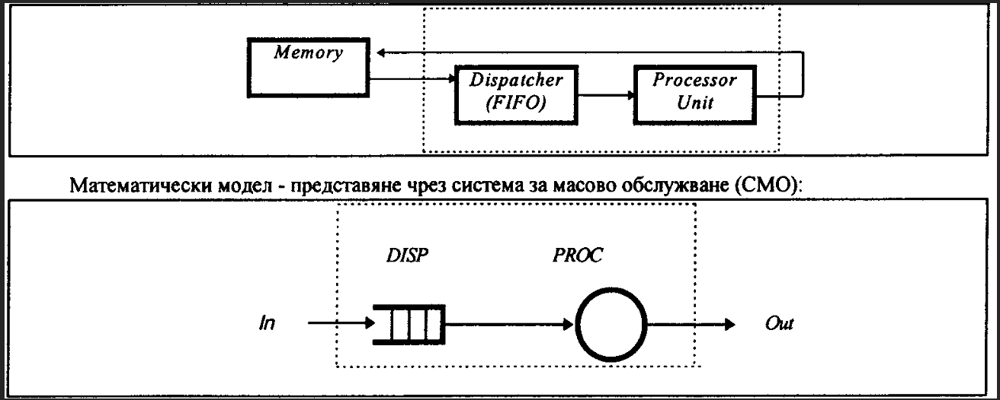
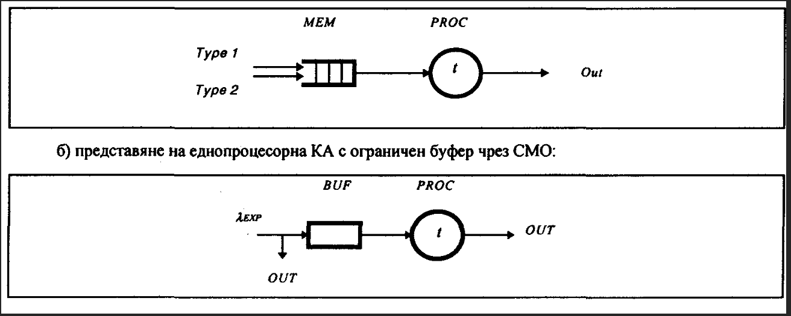

Лабораторно упражнение No 1
Oрганизация и особености на програмна среда за симулация. Изследване на системни характеристики и производителност на компютри 
1.	Теоретична постановка
1.1.	Профил на процесите и системни характеристики
Профил на изчислителните процеси.Компютьрната обработка представлява организирана съвкупност от процеси, свързани с обслужване на потребителските задачи в КС. Един процес се описва чрез тройката<t, А, Т>, където t- начален момент на процеса; А - дефиниращи атрибути, които определят източника на процеса (налр. потребител, програма и пр.); Т - трасе на процеса, характеризиращо последователността от събития по заемане на елементи от системния ресурс S.Дадено събитие ejсе характеризира с: момент на възникване; име на заеман системен ресурс; параметри за използваемостта на ресурса.
Процесите са два вида: (а) приложни процеси - за обслужване на потребителя чрез изпълнение на една потребителска задача; (б) системни процеси - пораждат се от операционната система за поддържане на приложни процеси и зависят от параметрите на отделна задача, дефинираща приложен процес, както и за обслужване на възникнали системни събития в КС, породени от вътрешни или външни причини (прекъсване, грешка, обмен, текущ контрол).
Профил на изчислителен процес е последователността от фази, реализиращи отделни събития за изграждане на цялостен изчислителен процес в КС. Примерен профил за една хипотетична ситуация е представен на следващата фигура. Събитията могат да бъдат: четене на данни; чакане във входна опашка за планиране; заемане на системен ресурс; процесорна обработка; - работа с външна памет; обмен на данни по канали за връзка и пр.
 
 
Поддържането на различни процеси при организацията на компютьрната обработка води до натоварване на отделните системни компоненти, което може да се представи чрез т.нар. профил на системно натоварване, дефиниран чрез вектор, чиито елементи отразяват свободно (vj=0)или заето (vj=1)устройство sj (j=l,2,....n) в последователните моменти от време t=1,2,...k.
Системни характеристики. Системните характеристики отразяват организацията на компютьрната обработка и поведението на КС при изпълнение на потребителски задачи. Зависят от структурната организация на КС, режима на работа и състава на ПО. Някои от основните характеристики са следните:
♦ Работно натоварване - време, през което дадено устройство е заето с приложен или системен процес:
При многозадачна работа в КС се развиват няколко процеса, които натоварват различни устройства (паралелна заетост) и тогава се говори за системно натоварване, определяно като сума от отделните работни натоварвания за устройствата:
j=1
♦ Време за отговор - времето от постъпване на текуща задача за обработка до получаване на резултата; най-често се определя т.нар. средно време за отговор, характеризиращо функционалните възможности и бързодействието на КС:
♦	Надеждност и отказа/устойчивост - определят способността КС да изпълнява коректно функциите за определен период от време. Оценява се чрез интензивността на отказите (брой откази за единица време), за което се използват вероятности методи, апаратът на Марковските вериги и теорията на масовото обслужване.
♦	Стойност (цена) - сумарна оценка за стойността на техническите средства и програмното осигуряване (влияе върху стойността за решаване на една задача):
където Wiе използваният при решаване на задачата обем от i-тия системен ресурс (i=l,2,...,n),а ki е стойностен коефициент, определящ теглото на ресурса при изчисляване на стойността на обработката.
♦	Множествен достъп до ресурса - дефинира способностите на КС да управлява множество от процеси, които се опитват да заемат едновременно един или няколко ресурси. Обикновено се поддържа диспечер, който поема функциите по разпределянето на системния ресурс между паралелните процеси и задава правилата за достъп и защита на общите обекта (данни, програми, устройства и пр.).
♦	Ниво на паралелизъм - способност на ОС да обработва паралелно различни по обем информационни единици. В зависимост от това могат да се дефинират: (а) локален и глобален паралелизъм; (б) паралелизъм от ниско и високо ниво при компютърната обработка.
♦	Стратегии (алгоритми) за планиране на задачите - свързани са с дипечерирането на независими процеси при псевдопаралелни и паралелни компютри и въвеждат правила при обслужване на постъпващите за обработка задачи.
 
 
 
 
 
1.1.	Изследване на производителността на КС
Производителността на КС е обобщено понятие, изразяващо възможностите и степента на изпълнение на операции и задачи, за които е предназначена. Дефинира се чрез количеството изчислителна работа, изпълнявана от КС за единица време P=W/T.Тъй като КС е комплекс от устройства и програми, всички те влияят върху общата производителност със своите параметри, представляващи количествени характеристики на т. нар. индекси (показатели) на производителността. Обикновено те са свързани с времената за изпълнение на основни действия от изчислителния процес.
Индексите на производителността на КС се измерват с различни по дименсия единици, а общата производителност е сложна нелинейна функция от тях. Примерни индекси на производителността са: брой инструкции, изпълнявани от процесора за единица време; скорост на информационния обмен между отделни устройства; цикъл на оперативната памет; пропускателна способност на информационните магистрали и пр.
При традиционните еднопроцесорни КС производителността може да се оцени чрез средното време за изпълнение на една операция top, т.е. Р=1/top. Аналогични съотношения могат да опишат и производителността на КС от конвейерен тип, ако последователността от функционални устройства се разглежда като един общ процесор.
При. високопроизводителните КС с паралелна организация на изчисленията общата производителност може да бъде определена на базата на индивидуалните оценки за производителността на отделен процесорен елемент. За паралелни КС с п на брой еднакви процесорни елементи (матрични, асоциативни, векторни) като оценка може да се даде Р*=пР. При мултипроцесорните системи е необходимо да се отчетат и загубите за организационни дейности. За еднородна мултипроцесорна система една обобщена оценка е Р*=(п.к)Р, докато за разнородна оценката е P(n)=kiPj (i=1,2,...,n), където коефициентът на загубите 0<ki<1 отчита участието на всеки отделен процесор в общата система.
На базата на производителността на КС се дефинира друг комплексен показател на функционирането - ефективност на КС. Той определя доколко е целесъобразно прилагането на КС за решаване на даден клас от задачи при оценяване на стойността и разходите за организацията на изчисленията. Тук се включват и разходите, свързани с експлоатацията на КС, поддържането на нейната работоспособност, проверката на техническите показатели и разходите по отстраняване на неизправностите.
Последното е свързано с надеждността на КС - свойството системата да запазва своите експлоатационни показатели в определени от производителя граници. Надеждността на невъзстановимите устройства често се измерва с вероятността за безотказна работа p(t)=[N0-n(t)]/N0, където N0е началният брой произведени устройства; n(t) - брой на отказалите устройства за интервала от време-t.Друга характеристика е вероятността за отказ: q(t)=1-p(t)=n(t)/NoНадеждността на възстановимите устройства обикновено се изчислява като средна честота на отказите - среден брой на откази на едно устройство за единица време в определен интервал.
Изследването на производителността за дадена КА е свързано с организиране на базовата структура и връзките между отделните устройства, избор на режим на работа, дефиниране на подходящо работно натоварване и пр. Това е изследване на системно ниво, оценяващо външните въздействия върху КС като едно цяло. Обект на изследване са: функционирането на процесорните възли; В/И канали и трактове на външната памет; обмена на данни между нива на общосистемната памет; диспечерирането на процеси; междупроцесните взаимодействия и пр. Основните задачи, решавани чрез системното изследване на КА, са следните:
♦ Задача на анализа - определяне на характерните свойства на дадена КС или за тип КА. Свързва се с избора на подходяща конфигурация или натоварване, работен режим или метод за диспечериране и пр. За системи в експлоатация се прилагат емпирични методи (измерване), докато при недостъпни системи могат да се използват методи за моделиране.
 
♦	Задача на идентификацията - свързва се с необходимостта от усъвършенстване на дадена система в експлоатация с цел повишаване на производителността и ефективността. Обикновено за оценяване на възможния ефект от усъвършенстването се използва модел на производителността.
♦	Задача на синтеза - изследване на системните характеристики и очакваната производителност на етапа на проектирането на една КС с избрана архитектура, режим на работа и приложение. По същество това е оптимизационна задача, за чието решаване е необходимо да се състави модел и да се проведат експерименти за дефиниране на глобален оптимум.
1.2.	Методи и средства за изследване на архитектури и процеси
За изследване и оценка на производителността на КС се използват различни методи и средства, като например:
♦	Програмни смеси - аналитични зависимости, базирани на коефициенти на използваемостта (ai) на различните класове от операции (i=1,2,...,n) и средното време за изпълнението им  при решаване на даден тип задачи, напр. P=(ai)/(ai.ti).Служат за приблизително определяне на производителността на КС с типични приложения. Поради несъвместимост на машинно ниво резултатите не са сравними за различни архитектури.
♦	Benchmark- оценяване на производителността на алтернативни системи чрез изследване на поведението и системните характеристики при еквивалентно работно натоварване (изпълнение на еталонни програмни приложения).
♦	Измерване - събиране на реални данни за протичащи процеси в изследваната КС чрез хронометриране и регистриране на сбъдването на определени събития, натрупване на данните и следващата им обработка за повишаване на тяхната информативносг. За целта се използват измерващи средства (монитори), които работят в реално време спрямо следените процеси. Изисква се висока точност на регистрацията и достоверност на резултатите, което се отразява в намаляване на гъвкавостта и по-голямата стойност. Прилагат се два метода за измерване:
#	Измерване по събитие (трасиране на процеси), при който регистрациите се управляват от промяната на състоянието на следения процес в резултат на сбъдването на събитие.
#	Измерване по часовник (избиращо измерване), осъществявано през равни интервали от време, задавани от системен таймер.
Основните видове монитори са:
#	Вградени - включени са в системното оборудване на КС още при нейното създаване (регистри, броячи, системни програми и пр.).
#	Микропрограмни - мониторни инструкции, включени в микропрограмното осигуряване (най- често с формат RX), които могат да следят за сбъдването на дадено събитие със зададен код Е и да регистрират текущото състояние на системния таймер и Е-кода в дума от паметта.
#	 Програмни - мониторни програми за снемане на текущи данни, регистрация на събития и съхраняване на измерената информация в област от паметта. Достъпът до мониторите от дадено приложение става чрез програмна сонда (контролна точка в програмата) и програмен превключвател (за временно съхраняване на системната информация и следващо възстановяване на процеса).
#	Апаратни - чрез непосредствена връзка (апаратна сонда) се регистрират събития на микрониво, като обикновено информацията се регистрира в два брояча: за следеното събитие и за общото време на измерването.
♦	Моделиране - представяне на определени страни на изчислителния процес или на апаратурата чрез математически, програмни и други достъпни средства за изследване на обекти. Това е метод за изследване на даден реален обект или процес чрез замяната му с друг, изкуствено създаден обект (модел). Технологичните етапи на моделния експеримент са следните:
 
а) Създаване на концептуален модел - математическа формализация и абстрактно представяне на общата архитектурна организация, свойствата на отделните компоненти и взаимозависимостта на процесите;
б) Подготовка на изходните данни - определяне на априорната информация за управляемите моделни параметри, които могат да имат постоянни стойности или да варират при последователни експерименти;
в) Разработване на математически модел - описание на концептуалния модел чрез математически средства за подходящо представяне на архитектурната организация и взаимодействието на процесите в нея;
г) Избор на метод и средства за моделиране - свързва се с преобразуване на математическия модел в програмен модел (описание чрез програмен език), за което могат да се използват главно два метода за моделиране - анапитично и симулационно. Изборът на метод за моделиране обикновено предопределя и използвания програмен език;
д) Калибровка на модела - проверка на адекватността му спрямо реалния обект;
е) Планиране на експеримента - план за провеждане на последователни изпълнения на модела при различни стойности за някои управляеми променливи с цел получаване на полезна информация за всички наблюдаеми променливи;
ж) Обработка и анализ на моделните резултати с цел получаване на оценки за системни характеристики и изводи за производителността.
Компютьрната симулация е подходящ метод за изследване на КА и процеси. Симулационното изследване е свързано с моделиране поведението на една КС чрез програма, която за своята работа използва реално работно натоварване или негов модел. Имитационният модел регистрира сбъдването на определени събития при протичане на процесите в системата и натрупва статистически данни. Една от разпространените програмни среди за симулация е GPSS (GeneralPurposeSimulationSystem),прилагана в няколко варианта (DSIM, GPSS/H, GPSS/PC и др.). Организацията и особеностите на средата са представени в Приложение.
2.	Задание за лабораторна работа
1.	 Да се разучат особеностите при организация на компютьрната обработка (профил на процесите, системни характеристики, производителност) и методите и средствата за изследване на КА и процеси.
2.	 Да се разучат особеностите на програмното симулиране на КА, организацията и функциите на специализираната програмна среда за симулационно изследване и основните блокове за описание на модела. Да се изследват основните режими на работа при организация на симулационни експерименти.
3.	 Да се симулира работата на еднопроцесорна КС с пакетна обработка. Да се изследва натоварването (R) на процесора чрез провеждане на симулационни експерименти с вариране на интензивността (X) на входния поток от задачи. Да се построи графично зависимостта R(X).
4.	 Да се изследва примерен модел на работно натоварване, дефиниращ случаен поток от задачи с експоненциално разпределение на интервалите между тях. След изпълнение да се изследват статистическите резултати в поддържаната таблица и да се построи хистограмата на полученото разпределение.
5.	Да се симулират следните примерни еднопроцесорни архитектури и се проведат вариационни изследвания за системното натоварване:
а) с два независими потока от задачи, с времена на постъпване, съответно 60±20 и 80±30 единици моделно време (ЕМВ) и времена за процесорна обработка, съответно 50±20 и 100±30;
б) с буферна cache-памет с ограничен капацитет (напр. 10) за постъпващите задачи (експоненциално разпределени) и време за обработка в процесора от 20 sec. до 100 sec., като симулацията да се извърши за 10 min. (мащаб 1 sec. =1 ЕМВ).
 
3. Лабораторни експерименти
По точка (1)
Запознаване с текстовия материал от теоретичната постановка 
По точка (2)
Запознаване с материала от Приложението, като се разучи предназначението и използваемостта на основните блокове.
За изследване на работата при организация на симулационни експерименти се изпълнява последователността:
/1/ Стартиране на системата чрез команда simи избор от главното меню на работен режим "редактиране" (чрез позициониране на курсора и потвърждаване с клавиш ENTER). При изискване име на работен модел се задава TIMER.
/2/ В празната екранна бланка се въвежда примерното описание на моделен часовник (дефинира общо моделно време за симулация):
Етикет	Оператор	Операнди (и коментар) 
    GENERATE

TERMINATE 
START   1
    300     ;зарежда начална стойност на системния таймер 
1         ; намалява съдържанието на системния таймер
стартира еднократно изпълнение на модела
В режим "редактиране” чрез клавиш F1 се извежда помощна информация за предназначението на функционалните клавиши.
/3/ Транслиране на модела - при успех се преглеждат резултатите от транслацията и се преминава към /4/; в противен случай са необходими корекции в режим на редактиране.
/4/ Изпълнение на модела (изчаква се завършването).
/5/ Извеждане на екран на стандартни статистики за таймер.
По точка (3)
Концептуален модел (абстрактно представяне на базовата структура):

 
Програмен симулационен модел:
GENERATE	10,5	-- постъпване на задачи през интервали от 5 до 15 ЕМВ
QUEUE	DISP	-- постъпване в опашката (дисциплина FCFS)
SEIZE	PROC	-- заемане на обслужващо устройство (ако е свободно)
DEPART	DISP	-- напускане на опашката
ADVANCE	5,3	-- времезадръжка за обслужване на задача
RELEASE	PROC	-- освобождаване на устройството
TERMINATE		-- унищожаване на заявка (обслужена задача)
GENERATE	300	-- дефинира общо време за симулация 300 ЕМВ
TERMINATE	1	
START	1	--стартира еднократно изпълнение
        
След въвеждане и успешна транслация на модела се провеждат експерименти (изпълнения) за различни интензивност на входния поток X [1/sec] (Х=0,025; 0,05; 0,075; 0,1; 0,15; 0,2), за които се снема съответното работно натоварване на процесора (PROC) R[%] от стандартната статистика. Резултатите се оформят в таблица, от която се строи графичната зависимост R=f(X).Интензивността се управлява чрез поле А на блок GENERATE(А=1/Х; А>В).
По точка (4)
Експериментът се провежда на базата на MODEL1 от програмната среда. При изследването му да се изяснят следните проблеми:
-	 дефиниране и използване на функции (FUNCTION);
-	 дефиниране и поддържане на таблици (TABLE, TABULATE, MARK);
-	 управление на симулацията по брояч на завършване (START).
След изпълнението се снема стандарта статистика за таблица XTIMEи се построява съответната хистограма.
По точка (5)
Работи се аналогично на т.З, като по-долу са дадени СМО-описанието и GPSS-моделите за двете архитектури.

Програмни симулационни модели за провеждане на експериментите:
GENERATE	60,20,,,2	— задачи от тип (1) cвисок приоритет
QUEUE	MEM	
SEIZE	PROC	
DEPART	MEM	
ADVANCE	50,20	
RELEASE	PROC	
TERMINATE	0	
GENERATE	80,30,,, 1	-- задачи от тип (2) с нисък приоритет
QUEUE	MEM	
SEIZE	PROC	
DEPART	MEM	
ADVANCE	100,30	
RELEASE	PROC	
TERMINATE	0	
GENERATE	2000	— задаване на общо моделно време
TERMINATE	1	
START	1	-- стартиране на симулацията
BUF	STORAGE 10		;дефиниране на буфер cкапацитет 10
    GENERATE	(Exponential(1,0,80))	;експоненциален входен поток от задачи
    TRANSFER	BOTH, LLL,OUT	; напускане при зает буфер (преход към OUT)
LLL	ENTER	BUF	; задача постъпва в буфера
    SEIZE	PROC	
    LEAVE	BUF	
    ADVANCE	60,20	
    RELEASE	PROC	
OUT	TERMINATE		
            
    GENERATE	600	; общо време за симулация 10 min=600 sec
    TERMINATE	1	
    START	1	
            
4. Съдържание на отчета
В отчета, оформен стандартно (име, факултетен номер, група, курс, дисциплина), се включва:
а) номер и тема на упражнението;
б) задание за лабораторна работа;
в) резултати от лабораторните експерименти по точки 3,4 и 5 от заданието.

